# Profile README — design review

Three directions for the **`elementmerc`** GitHub profile README. Same brand (red / grey / white / near-black), three different structures. Every header is a hand-built **animated SVG** — open each design to see it move.

> **How to view:** click **Open the full design** under any option below. Pick one and we finish it — wire up the auto-updating sections, add the keepalive so it survives untouched for years, and ship it to `README.md` on `main`.

---

## 1 · Mercury OS &nbsp;—&nbsp; the operator console

A live security-console HUD: rotating radar sweep, animated capability readout, a winged *messenger* emblem, a self-filling status bar.

**→ [Open the full design](previews/01-mercury-os.md)**

---

## 2 · Terminal Operator &nbsp;—&nbsp; the hacker shell

A terminal window that types itself out — `ssh`, `whoami`, `ls ./projects` — with a blinking cursor, scanlines and a drifting CRT beam.

**→ [Open the full design](previews/02-terminal.md)**

---

## 3 · The Masthead &nbsp;—&nbsp; the field journal

An editorial masthead: serif headline, a self-drawing rule, a slowly rotating press seal, a ghosted wordmark behind the type.

**→ [Open the full design](previews/03-masthead.md)**

---

Branch: `redesign` · none of this is live on the profile yet — `main` is untouched until a direction is chosen.
