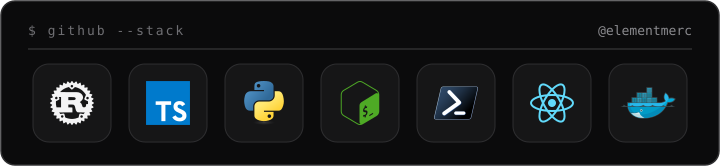
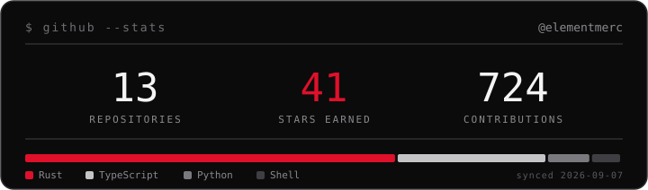

<div align="center">



<br/>

<a href="https://danieliwugo.com"></a>
<a href="https://twitter.com/ElementMerc"></a>
<a href="https://linkedin.com/in/elementmerc"></a>
<a href="https://medium.com/@mercurysnotes"></a>
<a href="https://www.freecodecamp.org/news/author/elementmerc/"></a>
<a href="https://tryhackme.com/p/ElementMerc"></a>
<a href="mailto:daniel@themalwarefiles.com"></a>

</div>

---

### `> cat ./about`

> Just your friendly neighbourhood hacker.

I pull software apart to see how intrusions actually happen, build tools around what I find, and write it all up so it's useful to someone other than me. Breaking things to learn, turning that into tooling, sharing the rest: that's been the shape of my work all along, whatever the day's target happens to be.

### `> neofetch`

<div align="center">





</div>

### `> ls ./projects`

```bash
drwxr-xr-x   anya/            # malware analysis platform, in Rust
drwxr-xr-x   stegcore/        # hides encrypted data in images and audio
drwxr-xr-x   dct-io/          # Rust library for embedding data in JPEGs
drwxr-xr-x   hacking-tools/   # personal security utilities, in Python
-rw-r--r--   writeups.md      # articles, notes and research
```

**[anya](https://github.com/elementmerc/anya)** &nbsp;·&nbsp; **[Stegcore](https://github.com/elementmerc/Stegcore)** &nbsp;·&nbsp; **[dct-io](https://github.com/elementmerc/dct-io)** &nbsp;·&nbsp; **[Hacking-Tools](https://github.com/elementmerc/Hacking-Tools)**

### `> tail -f ./writing.log`

<!-- AUTO:WRITING:START -->
- [Why hiding data in a JPEG is harder than you think](https://mercurysnotes.medium.com/why-hiding-data-in-a-jpeg-is-harder-than-you-think-daniel-iwugo-11a9ebedb69e)
- [How to Run Rust on Jupyter Notebooks](https://www.freecodecamp.org/news/how-to-run-rust-on-jupyter-notebooks/)
- [Bulletproof Hosting: The Internet’s Shadowy Landlords](https://mercurysnotes.medium.com/bulletproof-hosting-the-internets-shadowy-landlords-daniel-iwugo-fa72d48d35d8)
- [The Malware Files Official Publication Guidelines](https://themalwarefiles.com/the-malware-files-official-publication-guidelines-a8d62fcb67f4)
- [Koobface: Blueprints for a Social Botnet](https://themalwarefiles.com/koobface-a6144c5ff03d)
<!-- AUTO:WRITING:END -->

---

<div align="center">
<sub><code>MERCURYOS · node: Github</code></sub>
</div>

<!-- synced: 2026-06-01 -->
