<div align="center">



<br/>

<a href="https://danieliwugo.com"></a>
<a href="https://twitter.com/ElementMerc"></a>
<a href="https://linkedin.com/in/elementmerc"></a>
<a href="https://medium.com/@mercurysnotes"></a>
<a href="https://www.freecodecamp.org/news/author/elementmerc/"></a>
<a href="https://tryhackme.com/p/ElementMerc"></a>
<a href="mailto:daniel@themalwarefiles.com"></a>

</div>

---

## &#9698;&nbsp; SYSTEM BRIEF

I read malware the way other people read books — pulling software apart to understand how an intrusion *actually* works, then writing it down so the next defender starts a few steps ahead.

My work has always lived where three things overlap: **breaking things** to learn how they fail, **building tools** that turn that knowledge into something usable, and **teaching** — because security that stays in one person's head doesn't protect anyone. The targets change. That posture doesn't.

```ini
[ operator ]
role      = security researcher · tool builder · writer
focus     = malware analysis · reverse engineering · steganography
toolkit   = rust · python
principle = defend by thinking like the threat
node      = UTC+01:00 · 0xMERCURY
```

## &#9698;&nbsp; ACTIVE MODULES

> Tools I build and maintain in the open.

| Module | Function |
| :-- | :-- |
| **[anya](https://github.com/elementmerc/anya)** | A malware-analysis platform for examining malicious software — written in Rust. |
| **[Stegcore](https://github.com/elementmerc/Stegcore)** | A privacy-focused toolkit for concealing encrypted data inside images and audio. |
| **[dct-io](https://github.com/elementmerc/dct-io)** | A Rust library for embedding data inside JPEG images. |
| **[Hacking-Tools](https://github.com/elementmerc/Hacking-Tools)** | A growing set of personal security utilities in Python. |

## &#9698;&nbsp; TRANSMISSIONS

> Field notes, tutorials and research — latest first.

<!-- AUTO:WRITING:START — this list is regenerated automatically; the entries below are a live snapshot -->
- **[Large Language Models and Cybersecurity – What You Should Know](https://www.freecodecamp.org/news/large-language-models-and-cybersecurity/)**
- **[How Hackers Attack Social Media Accounts – And How to Defend Against Them](https://www.freecodecamp.org/news/how-to-protect-social-media-accounts-from-attackers/)**
- **[Linux for Hackers – Basics for Cybersecurity Beginners](https://www.freecodecamp.org/news/linux-basics/)**
- **[What is Steganography? How to Hide Data Inside Data](https://www.freecodecamp.org/news/what-is-steganography-hide-data-inside-data/)**
<!-- AUTO:WRITING:END -->

## &#9698;&nbsp; TELEMETRY

<div align="center">


</div>

---

<div align="center">
<sub><code>// mercury — messenger of the field · UTC+01:00</code></sub>
</div>
