---

## &#10073;&nbsp; THE BRIEF

> *Defend the system by first learning to think like the thing attacking it.*

Most software wants to be understood. Malware is the exception — it is written to be *misread*, built to slip past the very people whose job is to notice it. My work begins there: in the slow, unglamorous reading of things designed to deceive.

I research malicious software, build the tools that make that research repeatable, and write so that what I learn doesn't stay locked in my own notes. **Researcher, builder, writer** — the order shifts from one day to the next, but the work doesn't. I'd rather hand a defender a clear explanation than keep a clever finding to myself.

## &#10073;&nbsp; THE WORKBENCH

Tools and research I keep in the open:

**[anya](https://github.com/elementmerc/anya)** &mdash; a malware-analysis platform, written in Rust, for taking hostile software apart safely.

**[Stegcore](https://github.com/elementmerc/Stegcore)** &mdash; a privacy-focused toolkit for concealing encrypted data inside images and audio.

**[dct-io](https://github.com/elementmerc/dct-io)** &mdash; a small Rust library for embedding data inside JPEG images.

**[Hacking-Tools](https://github.com/elementmerc/Hacking-Tools)** &mdash; an ongoing collection of personal security utilities, written in Python.

## &#10073;&nbsp; FROM THE FILES

Selected writing — tutorials, explainers and field notes:

<!-- AUTO:WRITING:START — regenerated automatically; entries below are a live snapshot -->
> **[Large Language Models and Cybersecurity – What You Should Know](https://www.freecodecamp.org/news/large-language-models-and-cybersecurity/)**
> *How language models change the security picture — for attackers and defenders alike.*

- [How Hackers Attack Social Media Accounts – And How to Defend Against Them](https://www.freecodecamp.org/news/how-to-protect-social-media-accounts-from-attackers/)
- [Linux for Hackers – Basics for Cybersecurity Beginners](https://www.freecodecamp.org/news/linux-basics/)
- [What is Steganography? How to Hide Data Inside Data](https://www.freecodecamp.org/news/what-is-steganography-hide-data-inside-data/)
<!-- AUTO:WRITING:END -->

## &#10073;&nbsp; THE RECORD

---

<code>&mdash;&nbsp;30&nbsp;&mdash;</code>

